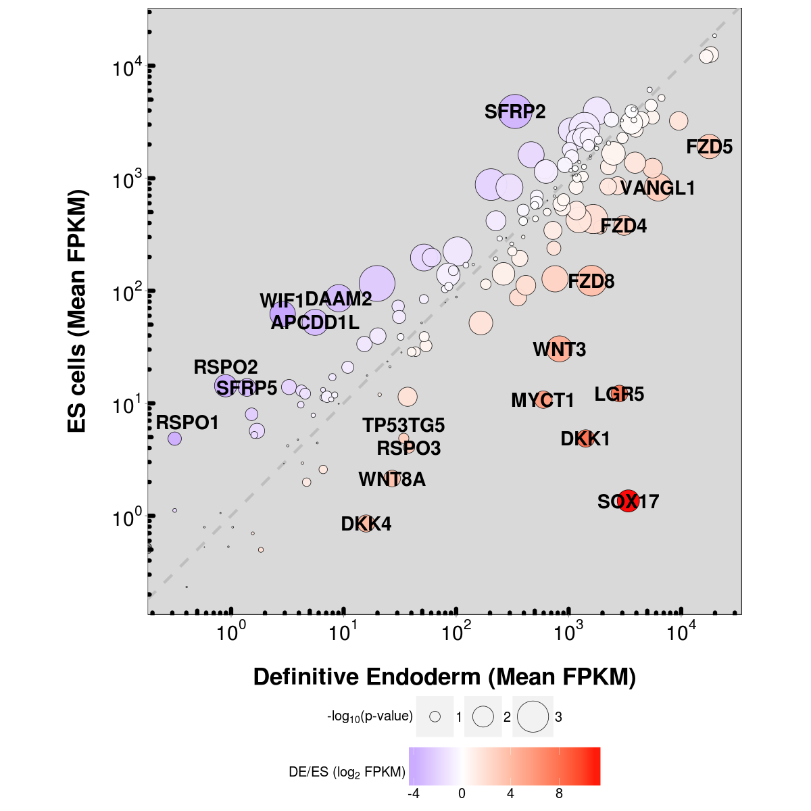

Yu-Hwai Tsai^1^, David R. Hill^1^, Namit Kumar^4^, Sha Huang^1^, Briana
R. Dye^2^, Michael P. Verzi^4^ and Jason R. Spence^1,2,3,\*^

^1^Division of Gastroenterology, Department of Internal Medicine
^2^Department of Cell and Developmental Biology ^3^Center for
Organogenesis University of Michigan Medical School, Ann Arbor,
Michigan, USA, 48109

^4^Department of Genetics Rutgers, The State University of New Jersey,
Piscataway, New Jersey 08854

^\*^Author for correspondence: spencejr@umich.edu @TheSpenceLab

Author Contributions: YHT and JRS conceived the study YHT, DRH, SH, BRD,
NK and MPV conducted experiments All authors analyzed data JRS wrote the
manuscript All authors edited and approved final manuscript

Summary
=======

The Lgr family of transmembrane proteins (Lgr4, 5, 6) act as functional
receptors for R-spondin proteins (Rspo 1, 2, 3, 4), and have been shown
to potentiate Wnt signaling in different contexts. Lgr5, arguably the
best characterized of the Lgr family members, was originally identified
as a marker of crypt base columnar (CBC) stem cells of the adult murine
intestine, and has subsequently been show to act as a stem cell marker
in many contexts. Moreover, Lgr members play functionally redundant
roles in CBC maintenance. Here, we show that LGR5 is part of the human
definitive endoderm (DE) “gene signature”, as LGR5 transcripts are
robustly induced when human pluripotent stem cells (hPSCs) are
differentiated into DE. Our results demonstrate that LGR4 and 5 function
redundantly during human endoderm induction. Consistent with data in
human DE, we observe Lgr5 reporter (eGFP) activity in the E8.5 mouse
endoderm, and show the ability to linage trace Lgr5-creER cells labeled
as early as E8.5 into the adult intestine. ChIPseq shows that LGR5 is
directly bound by *β*-catenin early during endoderm induction, and
functional experiments support a role for LGR proteins as potentiators
of WNT signaling during DE induction. Taken together, our results show
that LGR proteins are induced in DE, are functionally required for DE
induction, and that they function to potentiate WNT signaling during
this process.

Bioinformatics methods and results
==================================

Required hardware and software
------------------------------

### Hardware

The analysis machine has the following characteristics:

OS: Debian 7.9 wheezy Kernel: x86~64~ Linux 3.2.0-4-amd64 Shell: bash
4.2.37 CPU: Intel Xeon CPU E5504 @ 2GHz GPU: Quadro FX 380 RAM: 48340MB

### Software

The code is intended for the UNIX environment. The following software is
required to execute the analysis
-   FastQC v0.11.3
-   Bowtie 2 version 2.2.5
-   cufflinks v2.2.1
-   R version 3.2.2 (2015-08-14) -- "Fire Safety"

Scripts and github page prepared using GNU Emacs 24.5.1 with Org-mode
version 8.2.10

#### R package dependencies

``` {.r .rundoc-block rundoc-language="R" rundoc-session="*R*" rundoc-eval="yes" rundoc-exports="code" rundoc-tangle="./src/expression_analysis.R"}
# R package dependencies -------------------------------------------------------
install.packages(c("matrixStats","ggplot2","MASS","scales","grid"))
```

Tuxedo suite pipeline script
----------------------------

### Header

``` {.bash .rundoc-block rundoc-language="sh" rundoc-export="code" rundoc-eval="no" rundoc-tangle="./src/tuxedo_complete.sh"}
#! /bin/bash
GENES=/data/genomes/hg19_genes_refFlat.gtf
GENOME=/data/genomes/hg19.fa
INDEX=/data/genomes/hg19
```

### FastQC processing

``` {.bash .rundoc-block rundoc-language="sh" rundoc-export="code" rundoc-eval="no" rundoc-tangle="./src/tuxedo_complete.sh"}
#FASTQC quality control report generator
mkdir ../DATA/QC
for file in ../DATA/FASTQ/*.fastq* # will output filename as "$file"
do
    FILENAME="$file"       
    fastqc --outdir=../DATA/QC $FILENAME
done
```

### Tophat/Bowtie processing

``` {.bash .rundoc-block rundoc-language="sh" rundoc-export="code" rundoc-eval="no" rundoc-tangle="./src/tuxedo_complete.sh"}
#! /bin/bash
mkdir ../DATA/BAM
for file in ../DATA/FASTQ/*.fastq*
do
    SHORTNAME=$(basename "$file")
    NAME2="${SHORTNAME##*/}"
    DIRNAME="${NAME2%.*}"
    tophat2 -p 8 --b2-very-sensitive --no-coverage-search --no-novel-juncs --GTF $GENES -o ../DATA/BAM/$DIRNAME $INDEX $file
done
```

### Cufflinks processing

``` {.bash .rundoc-block rundoc-language="sh" rundoc-export="code" rundoc-eval="no" rundoc-tangle="./src/tuxedo_complete.sh"}
#! /bin/bash
for d in ../DATA/BAM/*/
do
    FILENAME="$file"       #set variable FILENAME equal to file from line 1
    SHORTNAME=$(basename "$file")
    NAME2="${SHORTNAME##*/}"
    DIRNAME="${d}"
    cufflinks -p 8 -o $DIRNAME --multi-read-correct --compatible-hits-norm --upper-quartile-norm --GTF $GENES ${d}*hits.bam
done
```

#### Merged transcriptome setup file

``` {.bash .rundoc-block rundoc-language="sh" rundoc-export="code" rundoc-eval="no" rundoc-tangle="./src/gtf_assembly.txt"}
../DATA/BAM/Sample_ES1/transcripts.gtf
../DATA/BAM/Sample_ES2/transcripts.gtf
../DATA/BAM/Sample_ES3/transcripts.gtf
../DATA/BAM/Sample_DE1/transcripts.gtf
../DATA/BAM/Sample_DE2/transcripts.gtf
../DATA/BAM/Sample_DE3/transcripts.gtf
```

### Cuffmerge/Cuffquant processing

``` {.bash .rundoc-block rundoc-language="sh" rundoc-export="code" rundoc-eval="no" rundoc-tangle="./src/tuxedo_complete.sh"}
#! /bin/bash
cuffmerge -g $GENES -s $GENOME -p 8 -o ../DATA/merged_asm gtf_assembly.txt
for d in ../DATA/BAM/*/
do
    FILENAME="$file"       #set variable FILENAME equal to file from line 1
    SHORTNAME=$(basename "$file")
    NAME2="${SHORTNAME##*/}"
    DIRNAME="${d}"
    cuffquant -p 8 -o $DIRNAME --max-mle-iterations 100000 -v --multi-read-correct ../DATA/merged_asm/merged.gtf ${d}*hits.bam
done
```

### Cuffdiff/Cuffnorm processing

``` {.bash .rundoc-block rundoc-language="sh" rundoc-export="code" rundoc-eval="no" rundoc-tangle="./src/tuxedo_complete.sh"}
mkdir ../RESULTS
# CUFFNORM
cuffnorm -o ./RESULTS/normout -p 8 -L ES,DefEnd ./DATA/merged_asm/merged.gtf \
../DATA/BAM/Sample_ES1/abundances.cxb,../DATA/BAM/Sample_ES2/abundances.cxb,../DATA/BAM/Sample_ES3/abundances.cxb \
../DATA/BAM/Sample_DE1/abundances.cxb,../DATA/BAM/Sample_DE2/abundances.cxb,../DATA/BAM/Sample_DE3/abundances.cxb 
```

R script
--------

### Import data from Cuffnorm output

``` {.r .rundoc-block rundoc-language="R" rundoc-session="*R*" rundoc-eval="yes" rundoc-exports="code" rundoc-tangle="./src/expression_analysis.R"}
## FPKM matrix input -----------------------------------------------------------
data1 <- read.table("../RESULTS/normout/genes.count_table",header=TRUE,sep="\t", stringsAsFactors = FALSE)
attr.table <- read.table("../RESULTS/normout/genes.attr_table",header=TRUE,sep="\t",stringsAsFactors = FALSE)
data1$gene_short_name <- attr.table$gene_short_name
# write out complete gene expression matrix
write.csv(data1, file="../RESULTS/ES&DE_dataset_cufflinksFPKM.csv")
```

### Generate row statistics

``` {.r .rundoc-block rundoc-language="R" rundoc-session="*R*" rundoc-eval="yes" rundoc-exports="code" rundoc-tangle="./src/expression_analysis.R"}
# Generate row stats --------------------------------------------------  
# rename data1 as database to fork downstream additions
database <- data1
# generate group shortnames for selecting columns
ES <- grep("ES", colnames(database),ignore.case=F)
DE <- grep("DefEnd", colnames(database),ignore.case=F)
 library(matrixStats)
## calculate mean by treatment type
database$es_mean <- rowMeans(database[,ES], na.rm=T)
database$de_mean <- rowMeans(database[,DE], na.rm=T)
 # calculate log2 change
database$xlog2 <- log2(database$de_mean/database$es_mean)
 ## function to compare by row, returns t distribution
## The function is currently defined as
row.t <- function(mat1,mat2){
  mat1 <- as.matrix(mat1)
  mat2 <- as.matrix(mat2)
  n1<-dim(mat1)[2]
  n2<-dim(mat2)[2] 
  n<-n1+n2 
  m1<-rowMeans(mat1,na.rm=TRUE) 
  m2<-rowMeans(mat2,na.rm=TRUE) 
  v1<-rowVars(mat1,na.rm=TRUE) 
  v2<-rowVars(mat2,na.rm=TRUE) 
  vpool<-(n1-1)/(n-2)*v1 + (n2-1)/(n-2)*v2 
  tstat<-sqrt(n1*n2/n)*(m1-m2)/sqrt(vpool) 
  return(tstat)}
 # calculate t-distribution for hES vs. Definitive endoderm
database$tstat <- row.t(database[,ES],database[,DE])
 # express t-dist as p-value
database$p <- 2*pt(-abs(database$tstat),df=2)
 # calculate Bonferroni correction
database$Bonf_p <- p.adjust(database$p, method = 'bonferroni', n = length(database$p))
database <- database[order(-database$xlog2),]
# output matrix with stats
write.csv(database,file="../RESULTS/ES&DE_dataset_cufflinksFPKM_stats.csv")
#--------------------------------------------------------------------------------
# SET CRITERIA FOR INCLUSION
# Fmpk cut-off 
fco <- 0.4
# P-value cut-off
pco <- 0.05
#--------------------------------------------------------------------------------
#Count the number of reads with Fmpk > 2 in each group 
database$es_count <- rowSums(database[,ES] >= fco)
database$de_count <- rowSums(database[,DE] >= fco)
# generate an output (present = 1, not present = 0) for each group
database$es_present <- ifelse(database$es_count > 1, 1, 0)
database$de_present <- ifelse(database$de_count > 1, 1, 0)
```

### "Volcano" expression plot

``` {.r .rundoc-block rundoc-language="R" rundoc-session="*R*" rundoc-eval="yes" rundoc-exports="code" rundoc-tangle="./src/expression_analysis.R"}
  # Generate "Volcano" expression plot -------------------------------------------
  # open png device
  png(filename = "../RESULTS/volcano_plot.png",
      width = 1200,
      height = 1200,
      units = "px",
      pointsize =10,
      bg = "white")
  par(lwd=6,
      mgp=c(9,3,0),
      # c(bottom, left, top, right)
      mar=c(12,15,1,1),
      font.lab=2,
      font.axis=1,
      cex.lab=5,
      font.main=2,
      cex.axis=5,
      bg="white")
  # Axis Labels
  ylab.name <- expression(paste("-log"[10],"(p-value)"))
  main.lab <- ""
  xlab.name <- expression(paste("Expression ratio DE/ES (log"[2]," FPKM)"))
  # subset for plotting
  # apply P-value cut-off
  vplot <- subset(database, database$p <= pco)
  # Gene expression must be present in at least one condition
  vplot.1 <- subset(vplot[51:nrow(vplot),],
                    vplot$es_present ==1 | vplot$de_present == 1)
  vplot.2 <- subset(database, database$p > pco)
  # subset to genes expressed in both conditions
  db <- subset(database, database$xlog2 != Inf|database$xlog2 != NA)
  # subset top 20 up-regulated genes (formerly top 50)
  db.50 <- db[1:20,]
  # subset LGR5
  lgr5 <- db[30,]
  plot(vplot.1$xlog2,-log10(vplot.1$p),
       type="n",
       ylab=ylab.name,
       xlab=xlab.name,
       col=rgb(0,0,139,90,maxColorValue=255),
       ylim= c(0,3.5),cex=2,xlim= c(-10,12))
  grid(lwd=3)
  lines(vplot.1$xlog2,-log10(vplot.1$p),
        type="p",
        col=rgb(65,105,225,100,maxColorValue=255),
          ylim= c(0,5),
          cex=2,
          xlim= c(-10,12))
  lines(vplot.2$xlog2,-log10(vplot.2$p),
          type="p",
          col=rgb(112,128,144,100,maxColorValue=255),
          cex=2)
  # points for top 20 upregulated
  lines(db.50$xlog2,-log10(db.50$p),
          type="p",
          col=rgb(178,34,35,150,maxColorValue=255),
          cex=2,
          pch=21,
          bg="white")
  # pont for LGR5
  lines(lgr5$xlog2,-log10(lgr5$p),
          type="p",
          col=rgb(178,34,35,150,maxColorValue=255),
          cex=4,
          pch=21,
          bg="red")
  n <- nrow(vplot)
  # add arrow for LGR5
  arrows(lgr5$xlog2-0.5,-log10(lgr5$p)+0.1,
         x1 = lgr5$xlog2,y1 = -log10(lgr5$p),
         lwd =5, col= "blue",length =0.1)
  #Add gene name labels to top 30 upregulated genes
  text(lgr5$xlog2-0.5,-log10(lgr5$p)+0.1,
       labels = lgr5$gene_short_name,
       col = "black",cex = 4,font = 4,pos = 2)
  text(db.50$xlog2[1:20],(-log10(db.50$p)[1:20]),
       labels = db.50$gene_short_name[1:20],
       col="black",cex=2,font=2)
  # Close plotting device
  dev.off()
```


Top 50 up-regulated genes (Supplemental Table 1)
------------------------------------------------

``` {.r .rundoc-block rundoc-language="R" rundoc-session="*R*" rundoc-eval="yes" rundoc-exports="code" rundoc-tangle="./src/expression_analysis.R"}
  # Supplemental Table 1 ---------------------------------------------------------
  db <- subset(database, database$xlog2 != Inf|database$xlog2 != NA)
  db.50 <- db[1:50,]
  write.csv(db.50,file="../RESULTS/top50upregulated_ES&DE.csv")
```

Wnt gene expression plot and Supplemental Table 2
-------------------------------------------------

``` {.r .rundoc-block rundoc-language="R" rundoc-session="*R*" rundoc-eval="yes" rundoc-exports="code" rundoc-tangle="./src/expression_analysis.R"}
  # Import Curated list of Wnt targets -------------------------------------------
  list <- read.csv("../DATA/Wnt_Gene_List.csv",header=FALSE)
  wnt.genes <- list[,1]
  # retrieve rows with gene names matching wnt,genes
  genes <- grep(paste(wnt.genes,collapse="|"),database$gene_short_name)
  wnt.expression <- as.data.frame(database[genes,])
  wnt.expression <- wnt.expression[order(wnt.expression$xlog2),]
  write.csv(wnt.expression, file = "../RESULTS/wnt_gene_expression.csv") # Supplemental Table 2
  wnt.expression <- subset(wnt.expression, wnt.expression$xlog2 != abs(Inf))
  # sort by absolute value of log2 expression ratio (biggest differences first)
  wnt.expression <- wnt.expression[order(-abs(wnt.expression$xlog2)),]
  # Plot expression in ggplot2 ---------------------------------------------------
  library(ggplot2)
  library(MASS)
  library(scales)
  library(grid)
  png(filename = "../RESULTS/wnt_scatter.png",
        width = 1200,
        height = 1200,
        units = "px",
        pointsize =10,
        bg = "white") 
  print(ggplot(data = wnt.expression) + 
            geom_abline(intercept = 0 , slope = 1,
                        color = "grey", size = 2, linetype = "dashed") +
            geom_point(shape = 21,alpha = I(0.95),
                       aes(de_mean, es_mean, size = -log(p,10),fill = xlog2)) +
            guides(fill = guide_colorbar(title = expression(paste("DE/ES (log"[2]," FPKM)"))),
                   size = guide_legend(title = expression(paste("-log"[10],"(p-value)")))) +
            scale_fill_gradient2(low = "blue", high = "red") +
            scale_x_log10(breaks = trans_breaks("log10", function(x) 10^x),
                          labels = trans_format("log10", math_format(10^.x))) +
            scale_y_log10(breaks = trans_breaks("log10", function(x) 10^x),
                          labels = trans_format("log10", math_format(10^.x))) +
            annotation_logticks(size = 3) +
            geom_text(data = wnt.expression[c(1:8,10:20),],
                      aes(de_mean,es_mean,label=gene_short_name),
                      size = 10, fontface = 2) +
            # Offset RSPO2 to improve visibility
            geom_text(data = wnt.expression[grep("RSPO2",wnt.expression$gene_short_name),],
                      aes(de_mean,es_mean+7,label = gene_short_name),
                      size = 10,fontface=2) +
            scale_size(range=c(0.25,25)) +
            labs(x = "\nDefinitive Endoderm (Mean FPKM)",
                 y = "ES cells (Mean FPKM)\n") +
            coord_fixed(ratio = 1) +
            theme(panel.grid.minor = element_blank(),
                  panel.grid.major = element_blank(),
                  legend.position = "bottom",
                  legend.key.size = unit(2, "cm"),
                  legend.text = element_text(size = 20),
                  legend.title = element_text(size = 20, face =2),
                  axis.text = element_text(size=30, color = "black", face = 2),
                  axis.title = element_text(size = 35, face = 2),
                  panel.background = element_rect(fill = "grey85", color = "black"))
        ) # close print window
  dev.off()
```



Complete workflow (Sequence alignment --&gt; Expression plots)
==============================================================

    #! /bin/bash
    # First execute tuxedo pipeline to generate FPKM data (this will take a long time)
    ./tuxedo_complete.sh
    # Then execute the R script
    Rscript expression_analysis.R

